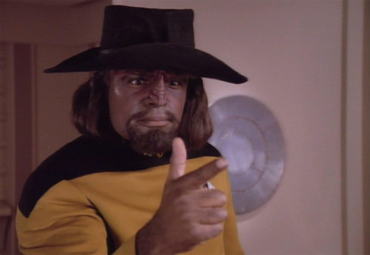
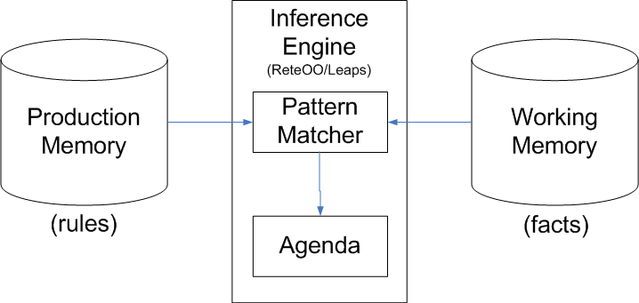

!SLIDE
<link media="screen" type="text/css" href="styles.css" rel="stylesheet" />

# The Worf Effect

!SLIDE

> **The Worf Effect** - n. When a resident tough character is beaten up to quickly show how badass someone else is.
[*](http://panelsonpages.com/?p=38275)

!SLIDE

### What's this talk is *really* about?

!SLIDE

# A rule engine! In Ruby!!

!SLIDE

## What's a rule engine?

!SLIDE

## Why use one?

 - Eliminate nested conditional logic
 - Scalable to frequently changing data
 - Clear separation of data and logic
 - Consistent language to describe business logic

!SLIDE

# Ruleby

A rule engine written in Ruby

 - [Github](https://github.com/Codalytics/ruleby)
 - [Presentation at Ruby Hoedown 08](http://www.confreaks.com/videos/604-rubyhoedown2008-ruleby-the-rules-engine-for-ruby)

!SLIDE code

## Given these datatypes:

@@@ ruby
      class Badass
        attr_accessor :name, :badass_level
        def initialize(name, badass_level)
          @name, @badass_level = name, badass_level
        end
      end

      class Klingon < Badass
      end
@@@

!SLIDE code

## And:

@@@ ruby
      class FightStat
        attr_accessor :badasses, :winner
        def initialize(badasses, winner)
          @badasses = badasses
          @winner = winner
        end
      end
@@@

!SLIDE

## We can construct rules such as:

> When there is a fight between Worf and another badass

> And the other badass is the winner

> Then the other badass' badass level is more than Worf's.

!SLIDE code

## In Ruleby:

@@@ ruby
      rule :worf_loses,
        [Klingon, :worf,
         m.name == "Worf"],

        [Badass, :badass,
         m.name => :n],

        [FightStat, :f,
         m.badasses(:worf, :badass, &c{|bs, w, b| bs.include?(w) && bs.include?(b)}),
         m.winner == b(:badass)]\
      do |vars|
        puts "Worf loses!"
        vars[:badass].badass_level = vars[:worf].badass_level + 10
        modify vars[:badass]
        retract vars[:f]
      end
@@@

!SLIDE code

## Data is represented as "facts":

@@@ ruby
      worf = Klingon.new("Worf", 100)
      riker = Badass.new("Riker", 100)
      borg = Badass.new("Drone", 100)
@@@

!SLIDE code

## We let the engine know the rules and facts:
@@@ ruby
      engine :engine do |e|
        WorfEffectRulebook.new(e).rules

        [worf, riker, borg].map{|badass| e.assert badass}
        e.assert FightStat.new([riker, worf], worf)
        e.assert FightStat.new([borg, worf], borg)

        e.match #And we let it rip!
      end
@@@

!SLIDE

#Demo

!SLIDE

## Conflict resolution

 - Salience/priority
 - Recency
